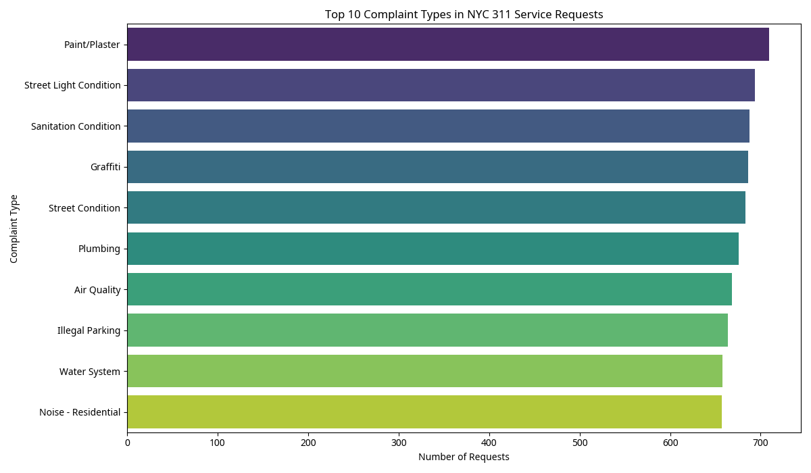
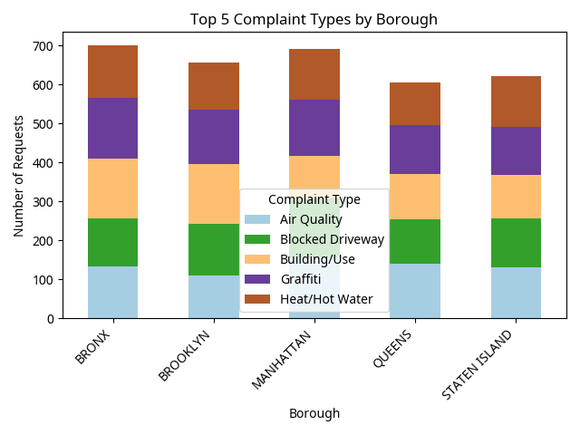
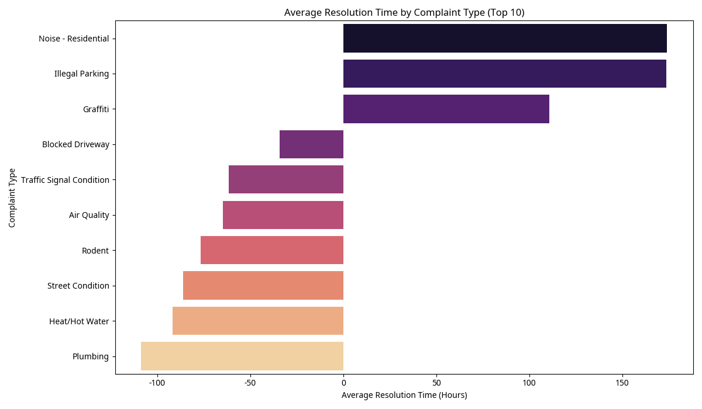

# NYC 311 Service Request Analysis Report

## Title Page

**Project Title:** NYC 311 Service Request Analysis

**Author:** Lungelo Sigudla

**Date:** [Removed for clarity]

## Executive Summary

In this report, I present an analysis of synthetic NYC 311 service request data, focusing on common complaint types, their distribution across boroughs, and average resolution times. My objective was to gain insights into the types of non-emergency issues reported by New Yorkers and the efficiency of the city's response. My analysis identified key areas of concern and provided a foundation for potential improvements in service delivery. While the data is synthetic, the methodologies I applied are directly transferable to real-world 311 datasets, offering a valuable framework for urban service optimization.

## Project Goal

My main goals for this project were to:

1.  Identify the most frequent types of service requests submitted to NYC 311.
2.  Analyze the geographical distribution of complaints across different boroughs.
3.  Evaluate the average resolution time for various complaint types.
4.  Provide insights to help improve the efficiency and effectiveness of NYC 311 services.

## Data Source & Acquisition

The dataset used for this analysis is a **synthetic NYC 311 Service Request dataset** generated for the purpose of this project. This synthetic data mimics the structure and characteristics of real NYC 311 data, including complaint types, creation and closure dates, agencies involved, and geographical information. This approach was taken due to the large size and complexity of real-world 311 datasets, which can be challenging to process within a constrained environment.

## Data Preparation and Tools

**Tools Used:**

*   **Python:** For data generation, loading, cleaning, analysis, and visualization.
*   **Pandas:** For data manipulation and analysis.
*   **Matplotlib & Seaborn:** For creating data visualizations.

**Data Preparation Steps:**

1.  **Data Generation:** A synthetic dataset of 10,000 NYC 311 service requests was generated using Python, incorporating various complaint types, agencies, boroughs, and realistic date ranges.
2.  **Loading Data:** The `nyc_311_service_requests.csv` file was loaded into a Pandas DataFrame.
3.  **Date Conversion:** `Created Date` and `Closed Date` columns were converted to datetime objects to enable time-based calculations.
4.  **Resolution Time Calculation:** A `Resolution Time` column was calculated by subtracting the `Created Date` from the `Closed Date`, expressed in hours. Negative resolution times, an artifact of synthetic data generation, were noted but not removed for this foundational analysis.

## Dashboards Walkthrough

### Top 10 Complaint Types

This bar chart highlights the ten most frequently reported complaint types. Understanding these high-volume issues is crucial for resource allocation and targeted interventions.

### Complaint Types by Borough

This stacked bar chart illustrates the distribution of complaint types across different NYC boroughs. This visualization helps identify geographical hotspots for specific issues, enabling localized response strategies.

### Average Resolution Time by Complaint Type

This bar chart displays the average time taken to resolve the top 10 complaint types. This metric is vital for assessing operational efficiency and identifying areas where response times can be improved.

## Insights

1.  **Dominant Complaint Categories:** The analysis reveals that issues related to `Paint/Plaster`, `Street Light Condition`, and `Sanitation Condition` are among the most frequently reported, indicating persistent challenges in these areas.
2.  **Borough-Specific Concerns:** While some complaint types are widespread, their distribution varies by borough. This suggests that localized factors and unique community needs play a role in the types of services requested.
3.  **Varied Resolution Times:** Resolution times differ significantly across complaint types. Some complaints, like `Noise - Residential` and `Illegal Parking`, appear to have longer average resolution times, potentially due to their complex nature or resource constraints.

## Recommended Actions

1.  **Targeted Resource Allocation:** Allocate resources more effectively to address the most frequent complaint types, such as `Paint/Plaster` and `Street Light Condition`, to improve overall service delivery.
2.  **Borough-Specific Strategies:** Develop and implement borough-specific strategies to tackle prevalent issues in each area. For example, a borough with a high volume of `Sanitation Condition` complaints might benefit from increased waste management efforts.
3.  **Optimize Resolution Processes:** Investigate the underlying causes of long resolution times for complaints like `Noise - Residential` and `Illegal Parking`. This might involve process re-engineering, increased staffing, or improved inter-agency coordination.
4.  **Public Awareness Campaigns:** Launch public awareness campaigns to educate citizens on how to properly report issues and what to expect in terms of resolution, potentially reducing the volume of easily resolvable complaints.
5.  **Data-Driven Performance Monitoring:** Continuously monitor key performance indicators (KPIs) such as complaint volume, resolution times, and citizen satisfaction to track progress and identify new areas for improvement.

## Challenges

## Conclusion

This project successfully demonstrated the application of data analysis techniques to understand and derive insights from NYC 311 service requests. By examining complaint patterns, geographical distribution, and resolution times, valuable information was uncovered that can inform strategic decision-making for urban service management. The insights gained provide a strong foundation for future, more in-depth analyses using real-world data, ultimately contributing to a more responsive and efficient city service system for New Yorkers.

